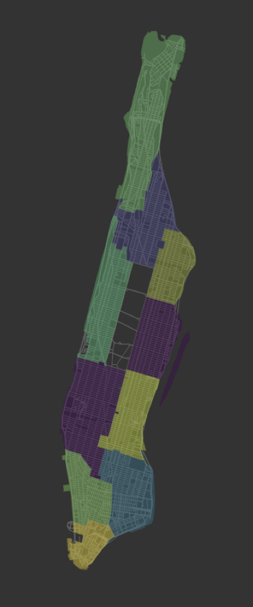

# Simple incentives for Ridesharing Fairness

This repository contains code, results and supplementary discussion for the paper titled "Using Simple Incentives to Improve Two-Sided Fairness in Ridesharing Systems", presented at the International Conference on Autonomous Planning and Scheduling (ICAPS 2023).

## Code usage
The following packages are required to run the code:
- Python=3.6
- Tensorflow-gpu=1.12
- Keras=2.2.4
- Cplex=12.10
- Pandas
- Numpy

In addition to the above packages, the code may also require some additional files. If any files are missing, they may be downloaded from the following URL:
https://www.mediafire.com/folder/hrokt4yux8h1s/ny .

Download any required files and place them in the folder ``Code\data\ny``.

### Execution
To run the code, navigate to ``Code\src_new`` and use the following command:

```
python test_driver_fair.py -c 4 -n 1000 -s 0 -e 24 -v pathnn -m "../models/pathnn_1000n_4c_233362.0.h5" -a 0 -b 2
```

This will run SIP(+) with $\beta$ = 2 for 24 hours of simulation, using a pre-trained NeurADP model.

To change the fairness function and parameters, use the following flags:
- ``-b`` : Float. Passenger fairness hyperparameter $\beta$ (SIP)
- ``-a``: Controls the change between SIP and SIP(+). Set to 1 for SIP, and 0 for SIP(+).
- ``-d`` : Float. Driver fairness hyperparameter $\delta$ (SID)
- ``-ad`` : Controls the change between SID and SID(+). Set to 1 for SID, and 0 for SID(+).


To use a different value function, just change the ``-v`` flag to one of the following options:
- NeurADP: ``-v pathnn``
- R+D: ``-v rewardplusdelay``
- AsyncNeural: ``-v random_greedy``
- Greedy: ``-v immediatereward``

The default solver is ``-sol ILP``. To use a random solver, change the ``-sol`` flag to ``-sol random``.

For more detailed console output, change verbose=True in line 65 of test_driver_fair.py.

### Results
The results are logged in a folder called ``Runs\`` in the parent directory of ``Code\``. 
Navigating to the relevant folder (e.g. ``Runs\SI\1000veh_4cap\DAY11(0-24)\alpha_d0.0\delta0.0\alpha0.0\beta2.0\PathBasedNN\``), one can find the logged outputs. ``'summary.pkl'`` contains the final stats of the run as a dictionary. It has the following fields:
```
summary = {
    "SR": Overall service rate, 
    "Mean pair SR": Average zone pair service rate,
    "Min pair SR": Minimum zone pair service rate,
    "Pair SR": A nested dictionary containing service rate values for each zone pair (Final discounted value), 
    "Pair SR Overall": A nested dictionary containing service rate values for each zone pair (Not discounted), 
    "Pair SR gini": Gini coefficient of zone pair service rates,
    "Mean source SR": Average source zone service rate,
    "Min source SR": Minimum source zone service rate,
    "Source SR": A dictionary containing service rate values for each source zone,
    "Source SR gini": Gini coefficient of source zone service rates,
    "Rewards": Total number of requests served,
    "Trips Per Driver": A list containing the number of trips served by each driver,
    "TPD gini": Gini coefficient of trips per driver,
    "TPD min": Minimum number of trips served by a driver,
    'runtime': Total runtime of the simulation test day,
    }
```

## Division of Manhattan into neighborhoods
We follow a simple procedure of creating neighbourhoods as a collection of zip codes. Each intersection in NYC is mapped to a zip code, as provided in the file ``Code\data\ny\neighbourhood_zones.json``. The zip codes are matched to the neighbourhoods as provided in the file ``Code\data\ny\neigh_zipcodes.json``. There are 10 neighbourhoods in Manhattan, as shown in the figure below:

<p align="center">
  
</p>